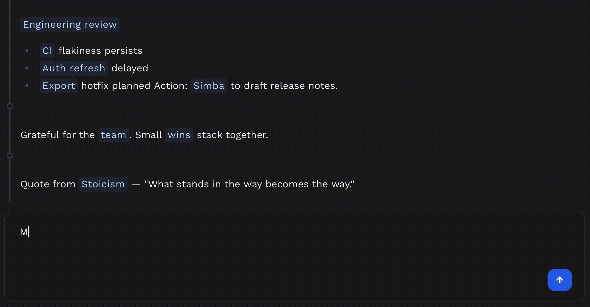
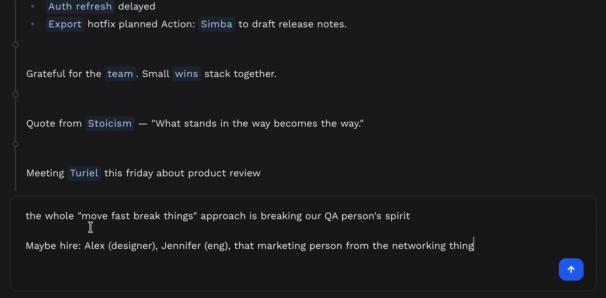
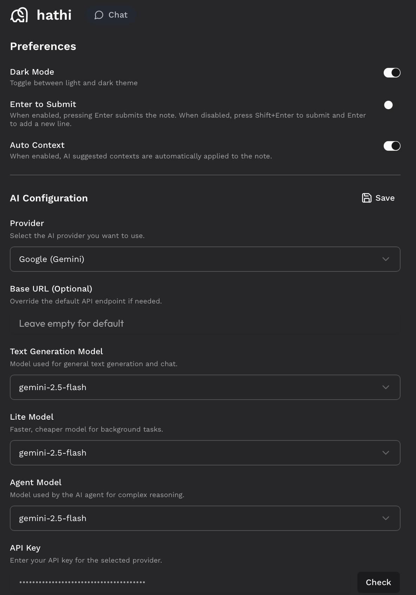

# Hathi

<p align="center">
  <picture>
    <source media="(prefers-color-scheme: dark)" srcset="public/hathi-icon-dark.svg">
    
  </picture>
</p>

<h1 align="center">
  Hathi - Your AI-Powered Second Brain
</h1>

<p align="center">
  <strong>Local-first, AI-powered note-taking that eliminates the friction of organization.</strong><br/>
  Dump your thoughts freely. Let AI handle the structure, context, and retrieval.
</p>

<p align="center">
  <a href="#why-hathi"><strong>Why Hathi?</strong></a> ·
  <a href="#features"><strong>Features</strong></a> ·
  <a href="#tech-stack"><strong>Tech Stack</strong></a> ·
  <a href="#setup"><strong>Setup</strong></a> ·
  <a href="#usage"><strong>Usage</strong></a>
</p>

<p align="center">
  
</p>

---

## Why Hathi?

Hathi is built on a simple philosophy:

<div role="note" aria-label="Key idea: Dump anything without worrying about the retrieval." style="background: linear-gradient(135deg, #667eea 0%, #764ba2 100%); padding: 20px; border-radius: 12px; margin: 16px 0; box-shadow: 0 4px 20px rgba(102, 126, 234, 0.3); border: 1px solid rgba(255, 255, 255, 0.2);">
  <strong>💡 Dump anything without worrying about the retrieval</strong>
</div>

This means you never have to worry about organizing your notes, typing full sentences, grammar, or formatting. Just dump them and let Hathi organize everything. And when you want to retrieve information from your personal knowledge graph, instead of searching, just ask Hathi!

### 🌐 Local-First, No Cloud Required

- **100% local storage** - Your notes never leave your machine
- **No subscriptions, no servers** - Complete data ownership
- **Offline-first** - Works entirely without internet (except for AI features)
- **Privacy-focused** - Your thoughts remain private

### 🧠 AI-First Note Taking

Stop worrying about:

- ❌ Perfect grammar and formatting
- ❌ Organizing notes into folders
- ❌ Remembering where you saved something
- ❌ Structuring your thoughts before writing

Start focusing on:

- ✅ **Capturing ideas instantly** as they come
- ✅ **Natural language** - write however you think
- ✅ **Automatic organization** - AI tags and categorizes for you
- ✅ **Effortless retrieval** - just ask Hathi

### 🎯 The Hathi Workflow

1. **Dump** - Write anything, anywhere. No formatting needed.
2. **Let AI structure** - Fixes grammar, adds context, identifies TODOs
3. **Ask when needed** - "What should I remember about John?" or "Get me started for today"
4. **Never search again** - Your AI agent finds what you need

---

## Features

### 📝 Note-Taking Without Friction

#### Contexts: Automatic Organization

Contexts are Hathi's way of organizing notes without manual folder management.

- **What are contexts?** - Intelligent tags that group related notes
- **How to use them?** - Wrap any word in double square brackets: `[[meeting]]`, `[[project-alpha]]`
- **Automatic linking** - Related notes connect automatically
- **Easy editing** - Rename contexts anytime; all notes update automatically

**Why contexts work:** Instead of "Where should I save this?", just write `[[work]]` or `[[ideas]]` and it's organized.

#### Smart Context Type-Ahead

As you type context brackets `[[`, Hathi provides intelligent suggestions based on your existing contexts:

- **Fuzzy matching** - Type `[[proj` to see all contexts containing "proj"
- **Recently used** - Most frequently used contexts appear first
- **Auto-complete** - Use arrow keys and Enter to select suggestions
- **Create new** - Type a new name and it becomes a new context automatically

This makes referencing existing contexts fast while keeping the option to create new ones seamlessly.

<p align="center">
  
</p>

> **💡 AI-Powered Organization:** Hathi's AI can automatically tag your notes with relevant contexts. See [Automatic Context Tagging](#automatic-context-tagging) for details.

#### Journal: Every Day is a Context

The journal page treats every date as a context. You can dump all your notes in today's journal without leaving the page. The context linking ensures that the notes are automatically linked to their contexts.

- **Today button** - Instantly jump to today's journal (keyboard shortcut friendly)
- **Date navigation** - Browse past and future dates with ease
- **Date contexts** - Each date (e.g., `[[2026-01-17]]`) is automatically a context
- **Timeline view** - See your day-by-day thought progression

**Pro tip:** Write meeting notes on their date, then reference them with `[[2026-01-17]]` from anywhere.

#### Smart Editor Features

- **Double-click to edit** - Create new notes or edit existing ones by double-clicking anywhere in the journal
- **Markdown support** - Format text with standard Markdown syntax
- **Auto-closing brackets** - Type `[[` and get `]]` automatically positioned
- **Context suggestions** - Start typing `[[proj` to see matching contexts
- **Real-time auto-save** - Never lose your work, every keystroke is saved

### 🤖 AI-Powered Intelligence

#### Automatic Vector Embeddings

**Every note is automatically semantically indexed.** When you create or update a note, Hathi generates vector embeddings using a local model—no API calls needed. These embeddings enable powerful semantic search, allowing the AI agent to understand meaning, not just match keywords.

**Benefits:**

- **Semantic organization** - Notes are organized by meaning, not just tags
- **Intelligent retrieval** - Find notes by concept, even with different wording
- **Privacy-first** - Embeddings generated locally on your machine
- **Automatic** - Works silently in the background on every note

#### Automatic Structuring

Write your thoughts freely without worrying about perfect grammar or formatting. Hathi's AI automatically cleans up your notes while preserving your original meaning.

**What it does:**

- **Fixes grammar and punctuation** - Transforms fragmented thoughts into proper sentences
- **Prettifies as Markdown** - Creates structured, readable text with headers, lists, and emphasis
- **Adds inline contexts** - Automatically inserts `[[context]]` tags where applicable
- **Preserves meaning** - Your ideas remain intact, just better expressed
- **Works on demand** - Click to structure any note when you're ready

**Example transformation:**

```
Before: "remember buy milk also finish report tomorrow john meeting 3pm"
After: "Remember to buy milk. Also finish report by tomorrow. John meeting at 3pm."
```

Think freely, write messily—the AI handles the polish.

<p align="center">
  
</p>

#### Intelligent TODO Detection

Automatically detects action items and extracts due dates from natural language—no need for strict date formats.

**Natural Language Date Understanding:**

Write dates however you naturally think—the AI understands and converts them to actual deadlines:

- **Relative dates**: "tomorrow", "next week", "in 3 days"
- **Day references**: "Monday", "next Friday", "this weekend"
- **Casual phrases**: "end of week", "by next month", "after lunch"
- **Specific dates**: "January 25", "on the 30th", "March 15th"

**Examples:**

- "Call Sarah about the project tomorrow" → Deadline: Jan 20, 2026
- "Remember to review the budget before Friday" → Deadline: Jan 24, 2026
- "Need to finish the presentation by end of week" → Deadline: Jan 26, 2026
- "Don't forget meeting at 3pm tomorrow" → Deadline: Jan 20, 2026 3:00 PM
- "Buy groceries after work" → Detected as TODO (no specific deadline)

The AI automatically identifies the action item, extracts the deadline from your natural language, and tracks it—all without you specifying structured data.

<p align="center">
  
</p>

#### Automatic Context Tagging

AI automatically analyzes your notes and suggests relevant contexts—building your knowledge graph with every entry.

**How it works:**

- **Learns from your contexts** - AI understands your existing context patterns and suggests matches
- **Suggests new contexts** - Identifies emerging themes and proposes new contexts when appropriate
- **Gets smarter over time** - The more contexts you have, the better the predictions become
- **Automatic enrichment** - Each note strengthens connections in your knowledge graph

**Example:** Write "discussed quarterly targets with Sarah from marketing" and the AI might suggest existing contexts like `[[work]]`, `[[marketing]]`, `[[quarterly-review]]`, or propose new ones like `[[sarah]]` if it's a new connection.

This ensures your notes are always properly connected, making retrieval effortless without manual organization.

<p align="center">
  
</p>

### 🔍 AI Agent: Your Information Retriever

Ask questions naturally and the agent finds relevant notes using semantic search, context filtering, and date ranges. View and edit source notes directly in the chat.

#### Example Queries

- "Get me started for today" - Surfaces relevant TODOs
- "What should I remember before meeting John?" - Pulls related notes with a quick summary
- "Show me ideas about the product launch" - Semantic search
- "What was decided in last week's meeting?" - Date + context filtering
- "Find notes about authentication" - Conceptual similarity

**Conversational**: Ask follow-up questions to dig deeper. The agent remembers context throughout the conversation.

---

## Tech Stack

### Core Technologies

- **Frontend**: Next.js 15 (App Router) + React 19
- **Language**: TypeScript (full type safety)
- **Styling**: Tailwind CSS + shadcn/ui components
- **State Management**: Redux Toolkit with redux-persist
- **Database ORM**: Drizzle ORM
- **Agent**: Vercel AI SDK

### Database Architecture

Hathi uses **SQLite** as the primary database (PostgreSQL support exists but is optional).

#### SQLite Schema

**Notes Table** (`notes`):

- `id` (TEXT) - UUID primary key
- `content` (TEXT) - Note content
- `key_context` (TEXT) - Primary context for the note
- `tags` (TEXT) - JSON array of tags
- `suggested_contexts` (TEXT) - AI-suggested contexts
- `note_type` (TEXT) - Type: 'note', 'todo', etc.
- `embedding` (TEXT) - JSON array (768-dim vector for semantic search)
- `embedding_model` (TEXT) - Model used for embedding
- `deadline` (INTEGER) - Unix timestamp for TODOs
- `status` (TEXT) - TODO status tracking
- `created_at`, `updated_at` (INTEGER) - Timestamps

**Contexts Table** (`contexts`):

- `id` (TEXT) - UUID primary key
- `name` (TEXT) - Unique context name
- `created_at`, `updated_at` (INTEGER) - Timestamps

**Notes-Contexts Junction** (`notes_contexts`):

- Many-to-many relationship between notes and contexts
- Enables notes to belong to multiple contexts

#### Vector Search

- **sqlite-vec extension** - Efficient vector similarity search
- **Configurable embeddings model** - By default, the app uses the multilingual-e5-base model that offers 768-dimensional embeddings. You can configure any other model from Hugging Face as long as it is supported by the transformers library.
- **Local embeddings** - Runs entirely on your machine (HuggingFace Transformers)

---

## Configuration & Settings

Hathi provides a configuration UI accessible directly from the application—no need to edit config files manually! Access all settings from the menu.

<p align="center">
  
</p>

### User Preferences

**Dark Mode Toggle**

- Switch between light and dark themes instantly
- Preference is saved locally and persists across sessions
- Optimized for comfortable reading in any lighting condition

**Enter to Submit**

- Control chat submission behavior in the AI agent
- When enabled: Press Enter to save the note (Shift+Enter for new line)
- When disabled: Press Enter for new line (Shift+Enter to save the note)

**Auto Context Suggestions**

- Toggle automatic context tagging powered by AI
- When enabled: AI automatically adds the relevant contexts to your note. It prefers your existing contexts, but may add a new context if it finds it highly relevant.
- When disabled: The AI still suggests you the contexts that are relevant to the note. You can double click on the note and accept these suggestions manually.
- Helps build your knowledge graph automatically without manual organization

### AI Configuration

Hathi currently supports **Google Gemini models** for the AI features and the Agent. Support for additional providers like **OpenAI** and **Anthropic** is planned for future releases.

**Setting Up Your API Key**

1. Get your Google AI API key from [Google AI Studio](https://aistudio.google.com/)
2. Open the Configuration UI in Hathi
3. Paste your API key and click "Validate"
4. The system confirms if your key is valid and working

**Configurable Models**

Hathi uses three AI models for different tasks:

1. **Text Generation Model** - Structures notes, fixes grammar, and generates text
2. **Lite Model** - Handles lightweight tasks like context suggestions and TODO extraction (use a cheaper model here to save costs)
3. **Agent Model** - Powers the AI chat agent

You can use the same Gemini model for all three or mix different models based on your needs. For example, use `gemini-2.5-flash` for the agent and `gemini-2.0-flash-lite` for the lite model to reduce costs.

Changes save automatically and apply immediately.

---

## Setup

### Prerequisites

- **Node.js 18+** (18.17.0 or higher recommended)
- **Yarn** package manager
- _Optional_: Google AI API key (for Gemini models)

### Quick Start with `start.sh`

Hathi includes an automated setup script that handles everything:

```bash
chmod +x start.sh
./start.sh
```

**That's it!** The script handles:

- ✅ Node.js installation (if needed)
- ✅ Dependency installation
- ✅ Environment configuration
- ✅ SQLite database setup
- ✅ Embedding model download (local, no API needed)
- ✅ Application launch

Visit [http://localhost:3000](http://localhost:3000) and configure your AI models from the UI.

### Manual Setup (Alternative)

If you prefer manual control:

#### 1. Install Dependencies

```bash
yarn install
```

#### 2. Configure Environment

Create `.env.local`:

```bash
# Database Configuration (SQLite - local file)
USE_DB=sqlite

# Google AI Configuration (Optional - configure from UI)
GOOGLE_AI_API_KEY=your-google-ai-api-key

# AI Provider Configuration
AI_PROVIDER=GEMINI                    # LLM provider
EMBEDDING_PROVIDER=HUGGINGFACE        # Embedding provider (local, no API)
EMBEDDINGS_DIMS=768                   # Vector dimensions

# AI Model Configuration (Optional - uses defaults)
GEMINI_TEXT_GENERATION_MODEL=gemini-2.5-flash
GEMINI_TEXT_GENERATION_LITE_MODEL=gemini-2.0-flash-lite
GEMINI_AGENT_MODEL=gemini-2.5-flash
HUGGINGFACE_EMBEDDING_MODEL=intfloat/multilingual-e5-base

# Optional: Performance Logging
LOG_PERF_TO_CSV=false

# Optional: Development Settings
NEXT_PUBLIC_DISPLAY_TOOL_INFO=false  # Show AI tool execution info
```

#### 3. Setup SQLite Database

```bash
# Run migrations to create tables
yarn db:sqlite:migrate

# Optional: Seed with sample data
yarn db:sqlite:seed
```

#### 4. Download Embedding Model (Optional)

For local embeddings without API calls:

```bash
yarn model:download
```

This downloads the HuggingFace model for offline use.

#### 5. Start Development Server

```bash
yarn dev
```

Open [http://localhost:3000](http://localhost:3000) in your browser.

### AI Configuration

**Configure from UI (Recommended):** Set your Google AI API key and select models directly in the app.

**Environment Variables (Alternative):** Use `.env.local` to configure models if preferred. UI settings override environment variables.

---

## Usage

### Creating Your First Note

1. **Open the app** at [http://localhost:3000](http://localhost:3000)
2. **Start typing** - No signup, no setup, just write
3. **Add context** - Type `[[project-name]]` to categorize
4. **Let AI help** - Grammar, structure, and TODOs handled automatically

### Using the Journal

1. **Click "Today"** button to jump to today's date
2. **Write daily notes** - Each date is a context automatically
3. **Navigate dates** - Use date picker to browse past/future entries
4. **Reference dates** - Link to specific days with `[[2026-01-17]]`

### Working with Contexts

```
# Creating contexts (automatic)
[[work]] [[meeting]] [[ideas]]

# Context suggestions (as you type)
Type "[[proj..." → See matching contexts

# Multiple contexts per note
[[project-alpha]] [[urgent]] [[client-meetings]]
```

### Using the AI Agent

Open the chat panel and try:

**Daily Planning:**

- "Get me started for today"
- "What are my pending tasks?"
- "What's on my agenda?"

**Information Retrieval:**

- "What should I remember about John?"
- "Show me recent notes about the product launch"
- "What was discussed in yesterday's meeting?"

**Date-based Queries:**

- "What did I write last week?"
- "Show me notes from January"
- "What happened on [[2026-01-15]]?"

**Context Filtering:**

- "All notes about [[project-alpha]]"
- "Work-related TODOs"
- "Show me urgent tasks"

### Editing Notes

- **In Journal**: Click any note to edit inline
- **In Agent Chat**: Click source notes to edit directly
- **Auto-save**: Changes save automatically as you type
- **Context updates**: Edit context names; all notes update

---

## Development

### Available Scripts

#### Development

- `yarn dev` - Start development server with Turbopack
- `yarn build` - Build for production
- `yarn start` - Start production server
- `yarn lint` - Run ESLint
- `yarn test` - Run tests with Jest
- `yarn test:watch` - Run tests in watch mode

#### SQLite Database (Primary)

- `yarn db:sqlite:migrate` - Run SQLite migrations
- `yarn db:sqlite:reset` - Reset SQLite database and run all migrations
- `yarn db:sqlite:seed` - Seed SQLite with sample data
- `yarn db:sqlite:fresh` - Truncate and reseed database
- `yarn db:sqlite:tables` - List all tables
- `yarn db:sqlite:schema` - Show database schema
- `yarn db:sqlite:data` - View table data
- `yarn db:sqlite:overview` - Show database overview

#### AI Configuration

- `yarn validate-config` - Validate AI configuration
- `yarn model:download` - Download local embedding model

### Project Structure

```
hathi-db/
├── app/                        # Next.js App Router
│   ├── actions/               # Server actions
│   │   ├── ai.ts             # AI operations (structurize, suggest contexts)
│   │   ├── notes.ts          # Note CRUD operations
│   │   └── contexts.ts       # Context management
│   ├── agent_tools/          # AI Agent tools
│   │   ├── filter-notes.ts   # Advanced note filtering
│   │   ├── semantic-search.ts # Vector similarity search
│   │   └── summarize-notes.ts # Note summarization
│   ├── api/chat/             # Chat API endpoint
│   └── journal/              # Journal page routes
├── components/
│   ├── journal/              # Journal components
│   │   ├── editor/           # Note editor with plugins
│   │   ├── note_card/        # Note display components
│   │   └── date-context-picker.tsx
│   ├── chat/                 # AI agent chat interface
│   └── ui/                   # shadcn/ui components
├── db/
│   ├── sqlite/               # SQLite implementation
│   │   ├── schema.ts        # Database schema
│   │   ├── adapter.ts       # Database operations
│   │   └── migrate-runner.ts
│   ├── postgres/             # PostgreSQL (optional)
│   └── types.ts              # Shared types
├── lib/
│   ├── ai/                   # AI service layer
│   │   ├── gemini.ts        # Gemini LLM integration
│   │   ├── huggingface-embedding.ts # Local embeddings
│   │   └── ai-config.ts     # Configuration management
│   ├── prompts/              # AI prompts
│   ├── noteUtils.ts          # Note manipulation utilities
│   ├── date-utils.ts         # Date formatting
│   └── bracketMatchUtils.ts  # Context bracket handling
├── store/                    # Redux state management
│   ├── notesSlice.ts        # Notes state
│   ├── journalSlice.ts      # Journal state
│   ├── agentSlice.ts        # Agent state
│   └── middleware/          # Persistence middleware
├── hooks/                    # Custom React hooks
├── scripts/
│   ├── download-model.js    # HuggingFace model downloader
│   └── validate-config.ts   # Config validation
└── start.sh                 # Automated setup script
```

### Key Concepts

#### Database Architecture

Hathi uses **SQLite with sqlite-vec** for local storage:

- **Notes table**: Stores note content, metadata, and embeddings
- **Contexts table**: Stores context definitions
- **Notes-Contexts junction**: Links notes to multiple contexts
- **Vector embeddings**: 768-dimensional vectors for semantic search
- **Similarity search**: Uses cosine similarity to find related notes

#### AI Pipeline

1. **Note Creation** → Extract contexts with `[[...]]` regex
2. **AI Processing** → Suggest contexts, detect TODOs, extract deadlines
3. **Structurization** (optional) → Clean up grammar and formatting
4. **Embedding Generation** → Create 768-dim vector (local)
5. **Storage** → Save to SQLite with all metadata

#### Agent System

The AI agent uses multiple tools:

- **filter_notes**: Filter by date, context, type, or content
- **semantic_search**: Find similar notes using vectors
- **summarize_notes**: Summarize note collections
- **get_filter_options**: List available contexts and tags

### Development Tips

#### Debugging AI Operations

Enable tool info display:

```bash
# In .env.local
NEXT_PUBLIC_DISPLAY_TOOL_INFO=true
```

Or toggle in browser console:

```javascript
window.toggleToolInfo();
```

#### Testing Database Operations

```bash
# Reset and seed database
yarn db:sqlite:fresh

# Inspect database
yarn db:sqlite:overview
yarn db:sqlite:schema
```

#### Performance Monitoring

Enable CSV logging:

```bash
# In .env.local
LOG_PERF_TO_CSV=true
```

Check `performance_log.csv` for operation timings.

---

## Architecture Decisions

**Local-First**: Privacy, speed, ownership, and offline capability (except AI features).

**SQLite**: Embedded, portable, fast, with native vector search via sqlite-vec. Zero configuration.

**AI-First**: Traditional note-taking requires upfront organization and manual search. Hathi inverts this—write freely, AI organizes automatically, and your agent retrieves information naturally.

---

## FAQ

### Do I need an API key?

**For basic use: No.** Local embeddings work without any API.

**For AI features: Yes.** You need a Google AI API key for:

- Context suggestions
- Note structurization
- TODO detection
- AI agent chat

Configure it from the UI or set `GOOGLE_AI_API_KEY` in `.env.local`.

### Is my data private?

**Yes, completely.** All notes are stored in a local SQLite file on your machine. Nothing is sent to any cloud service except:

- AI API calls (if you enable AI features)
- These only send note content for processing, not the entire database

### Can I use it offline?

**Mostly yes.** You can create, edit, browse, and search notes offline with local embeddings. Internet is only needed for AI features (structurization, context suggestions, agent queries).

### How accurate is TODO detection?

Very accurate. The system recognizes:

- Explicit keywords: "todo", "remember", "don't forget"
- Action verbs: "call", "email", "buy", "finish"
- Checkbox formats: `[ ]`, `- [ ]`, `* [ ]`
- Temporal phrases: "tomorrow", "next week", "by Friday"

Due dates are automatically extracted from natural language.

### Can I export my data?

Your data is already in an open format:

- **Database**: SQLite file at `local.db` (use any SQLite browser)
- **Format**: Standard SQL schema, easy to export
- **No lock-in**: Simple migration to other systems

### How do I backup my notes?

Simply backup the `local.db` file (SQLite database). You can:

- Copy it to cloud storage
- Version control with git
- Use any backup solution

---

## Contributing

Contributions are welcome! Please:

1. Fork the repository
2. Create a feature branch (`git checkout -b feature/amazing-feature`)
3. Commit your changes (`git commit -m 'Add amazing feature'`)
4. Push to the branch (`git push origin feature/amazing-feature`)
5. Open a Pull Request

### Development Guidelines

- Use TypeScript for type safety
- Use Yarn (not npm or pnpm)
- Follow existing code structure
- Add tests for new features
- Update documentation as needed

---

## License

This project is licensed under the **MIT License**.

Permission is hereby granted, free of charge, to any person obtaining a copy of this software and associated documentation files (the "Software"), to deal in the Software without restriction, including without limitation the rights to use, copy, modify, merge, publish, distribute, sublicense, and/or sell copies of the Software, and to permit persons to whom the Software is furnished to do so, subject to the following conditions:

The above copyright notice and this permission notice shall be included in all copies or substantial portions of the Software.

THE SOFTWARE IS PROVIDED "AS IS", WITHOUT WARRANTY OF ANY KIND, EXPRESS OR IMPLIED, INCLUDING BUT NOT LIMITED TO THE WARRANTIES OF MERCHANTABILITY, FITNESS FOR A PARTICULAR PURPOSE AND NONINFRINGEMENT. IN NO EVENT SHALL THE AUTHORS OR COPYRIGHT HOLDERS BE LIABLE FOR ANY CLAIM, DAMAGES OR OTHER LIABILITY, WHETHER IN AN ACTION OF CONTRACT, TORT OR OTHERWISE, ARISING FROM, OUT OF OR IN CONNECTION WITH THE SOFTWARE OR THE USE OR OTHER DEALINGS IN THE SOFTWARE.

See the [LICENSE](LICENSE) file for full details.

---

## Acknowledgments

- **Next.js** - React framework
- **Vercel AI SDK** - AI integration
- **Drizzle ORM** - Type-safe database
- **shadcn/ui** - UI components
- **sqlite-vec** - Vector search in SQLite
- **HuggingFace Transformers** - Local embeddings
- **Google Gemini** - LLM capabilities

---

## Future Roadmap

Hathi is actively evolving to become an even more powerful AI-powered second brain. Here are the exciting features planned for future releases:

### 🔄 Automatic Database Backup

- [ ] **Scheduled backups** - Automatic daily/weekly backup of your local database
- [ ] **Cloud sync options** - Optional integration with cloud storage providers
- [ ] **Version history** - Keep multiple backup versions with restore capabilities
- [ ] **Cross-device sync** - Seamlessly access your notes across multiple devices

### 🔌 MCP Integration with Agent

- [ ] **Model Context Protocol support** - Enhanced AI agent capabilities through MCP
- [ ] **Extended tool ecosystem** - Access to a broader range of AI tools and services
- [ ] **Better reasoning** - More sophisticated agent interactions and workflows
- [ ] **Plugin architecture** - Community-driven extensions for specialized use cases

### 📝 Custom Prompt Templates

Define your own AI workflows and templates for different scenarios:

- [ ] **Email templates** - Generate professional emails with your personal style
- [ ] **Daily summary templates** - Customize how your daily summaries are formatted
- [ ] **Meeting note templates** - Standardized formats for different meeting types
- [ ] **Content generation** - Custom prompts for blogs, reports, or creative writing
- [ ] **Workflow automation** - Chain multiple AI operations with custom prompts

### 📅 Weekday Context Descriptions

A prompt for each day of the week that can be used by the AI to generate the `get me started for today` responses. Personalize your weekly workflow for smarter daily summaries:

- [ ] **Monday setup** - "Planning day: Review weekly goals and priorities"
- [ ] **Wednesday check-ins** - "Mid-week review: Assess progress and adjust plans"
- [ ] **Friday wrap-ups** - "Reflection day: Document learnings and plan next week"
- [ ] **Custom descriptions** - Define what you typically do on each weekday
- [ ] **Smart summaries** - AI uses weekday context to generate relevant "get me started" prompts

### 🎨 Enhanced User Interface

- [ ] **Professional redesign** - Modern, intuitive interface design
- [ ] **Accessibility improvements** - Better support for screen readers and keyboard navigation
- [ ] **Mobile optimization** - Responsive design for seamless mobile note-taking
- [ ] **Customizable themes** - Multiple color schemes and layout options
- [ ] **Looking for UI designers** - Open to collaboration with talented designers

### 📜 Infinite Scroll Journal

- [ ] **Seamless date navigation** - Scroll through dates without page reloads
- [ ] **Performance optimization** - Efficient loading of large date ranges
- [ ] **Smooth transitions** - Fluid scrolling experience across months and years
- [ ] **Date anchoring** - Maintain context while browsing historical entries
- [ ] **Quick navigation** - Jump to specific dates while maintaining scroll position

---

<p align="center">
  Made with ❤️ for better note-taking
</p>
